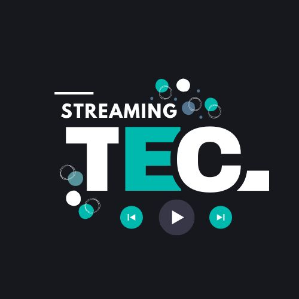

# StreamingTEC

<a id="readme-top"></a>

<!-- PROJECT HEADER -->
<br />
<div align="center">
  <a href="https://github.com/BrithannyAL/StreamingTec">
    
  </a>

  <h3 align="center">StreamingTEC</h3>

  <p align="center">
    Un sistema multimedia distribuido para streaming de contenido.
  </p>
</div>


## Tabla de Contenidos

1. <a href="#about-the-project">Acerca del Proyecto</a>
2. <a href="#built-with">Tecnologías Utilizadas</a>
3. <a href="#system-architecture">Arquitectura del Sistema</a>
4. <a href="#getting-started">Instrucciones de Instalación</a>
5. <a href="#usage">Guía de Uso</a>
6. <a href="#credits">Contribuciones y Créditos</a>
7. <a href="#authors">Autoras</a>


<!-- ABOUT THE PROJECT -->
## Acerca del Proyecto

StreamingTEC es un sistema multimedia distribuido para la transmisión de contenido, diseñado para permitir a los usuarios acceder a vídeos y música desde múltiples plataformas. El sistema garantiza alta escalabilidad, balanceo de carga y alta disponibilidad, con rendimiento óptimo en diferentes configuraciones de red como la nube, redes locales y Edge Computing.

### Características:
* Soporte para múltiples plataformas.
* Manejo eficiente de múltiples solicitudes simultáneas.
* Balanceo de carga y gestón de procesos.
* Interfaces adaptativas para diferentes dispositivos.
* Rendimiento optimizado para redes locales y la nube.

<p align="right">(<a href="#readme-top">volver arriba</a>)</p>


<!-- BUILT WITH -->
## Tecnologías Utilizadas

Este proyecto fue construido con las siguientes tecnologías:

* [![React][React.js]][React-url]
* [![Node.js][Node.js]][Nodejs-url]
* [![Firebase][Firebase]][Firebase-url]
* [![Bootstrap][Bootstrap]][Bootstrap-url]
* [![Google Cloud Storage][GCP]][GCP-url]
* [![NGINX][NGINX]][NGINX-url]
* [![AWS EC2][AWS EC2]][AWS EC2-url]

<p align="right">(<a href="#readme-top">volver arriba</a>)</p>

<!-- SYSTEM ARCHITECTURE -->
## Arquitectura del Sistema

La arquitectura de StreamingTEC está compuesta por los siguientes componentes:

- **Frontend (React)**: La interfaz de usuario interactúa con el backend para solicitar el contenido multimedia.
- **Servidores Backend (Node.js en AWS EC2 con PM2)**: Tres servidores (audios, videos, series) gestionan las solicitudes de contenido.
- **NGINX (Balanceador de carga)**: Distribuye el tráfico de manera eficiente entre los servidores backend.
- **Firebase**: Gestiona las direcciones URL de los archivos multimedia.
- **Google Cloud Storage**: Almacena los archivos multimedia (videos, audios, series) a los que acceden los servidores backend.

### Diagrama de Arquitectura


<!-- GETTING STARTED -->
## Instrucciones de Instalación

### Prerrequisitos

Antes de instalar el proyecto, asegúrate de tener lo siguiente instalado:

* Node.js v14.0 o superior
* npm v6.0 o superior
### Instalación
1. Clona el repositorio:
 ```sh
 git clone https://github.com/BrithannyAL/StreamingTec
 ```
2. Instala las dependencias del proyecto:
 ```sh
 npm install
 ```


<p align="right">(<a href="#readme-top">volver al inicio</a>)</p>

<!-- USAGE -->
## Guía de Uso
A continuación se describen los pasos necesarios para clonar, configurar y ejecutar este proyecto de manera local.

### 1. Clonar el repositorio:
Primero, es necesario clonar el repositorio desde GitHub utilizando el siguiente comando:
 ```sh
 git clone https://github.com/BrithannyAL/StreamingTec.git
 ```
Esto descargará una copia local del código fuente del proyecto en su máquina.

### 2. Instalar las dependencias
Una vez clonado el repositorio, será necesario instalar las dependencias requeridas por el proyecto tanto en el frontend (carpeta streaming-tec) como en el backend (carpeta backend). Para ello, siga los siguientes pasos:
* Diríjase a la carpeta del frontend y ejecute el siguiente comando para instalar las dependencias de Node.js:
```sh
cd streaming-tec
npm install
```
* Luego, instale las dependencias del backend dentro de la carpeta backend:
```sh
cd ../backend
npm install
```

### 3. Iniciar la aplicación de React
Una vez instaladas las dependencias, puede iniciar la aplicación de React en modo de desarrollo. Asegúrese de estar ubicado en el directorio streaming-tec y ejecute el siguiente comando:
```sh
cd ../streaming-tec
npm start
```
Esto iniciará el servidor de desarrollo de React. Si la configuración es correcta, la aplicación debería abrir automáticamente en su navegador predeterminado en la dirección http://localhost:3000.

### 4. Usar la plataforma
Una vez que la aplicación esté corriendo, puede comenzar a interactuar con la plataforma y utilizar todas sus funcionalidades.

Asegúrese de revisar la documentación adicional y los comandos disponibles en caso de necesitar realizar ajustes o configuraciones adicionales.


<p align="right">(<a href="#readme-top">volver arriba</a>)</p>

<!-- CREDITS -->
## Contribuciones y Créditos
Las contribuciones son lo que hacen que la comunidad de código abierto sea un lugar increíble para aprender, inspirar y crear. Cualquier contribución que hagas es grandemente apreciada.

Si tienes una sugerencia para mejorar el proyecto, por favor sigue los siguientes pasos:

1. Haz un fork del proyecto.
2. Crea tu rama de funcionalidad (git checkout -b feature/nueva-funcionalidad).
3. Haz commit de los cambios (git commit -m 'Agregar nueva funcionalidad').
4. Haz push a la rama (git push origin feature/nueva-funcionalidad).
5. Abre un Pull Request.
   
### Créditos
* [React Documentation](https://reactjs.org/docs/getting-started.html)
* [Node.js Documentation](https://nodejs.org/en/docs/)
* [Firebase Documentation](https://firebase.google.com/docs)
* [Bootstrap Documentation](https://getbootstrap.com/docs/)
* [Amazon Lightsail Documentation](https://aws.amazon.com/documentation/lightsail/)
* [Google Cloud Storage Documentation](https://cloud.google.com/storage/docs)
* [NGINX](https://www.nginx.com/)
* [AWS EC2](https://aws.amazon.com/)
<p align="right">(<a href="#readme-top">volver arriba</a>)</p> 

<!-- AUTHORS -->
## Autoras

Este proyecto fue desarrollado por:

- **[Brithanny Arguello Lara](https://github.com/BrithannyAL)**
- **[Katherine Amador González](https://github.com/KatherineDAG)** 
- **[Karina Urbina Alvarez](https://github.com/KariUA)**


<p align="right">(<a href="#readme-top">volver arriba</a>)</p>


<!-- MARKDOWN LINKS & IMAGES -->
[React.js]: https://img.shields.io/badge/React-20232A?style=for-the-badge&logo=react&logoColor=61DAFB
[React-url]: https://reactjs.org/
[Node.js]: https://img.shields.io/badge/Node.js-43853D?style=for-the-badge&logo=node.js&logoColor=white
[Nodejs-url]: https://nodejs.org/
[Firebase]: https://img.shields.io/badge/Firebase-FFCA28?style=for-the-badge&logo=firebase&logoColor=white
[Firebase-url]: https://firebase.google.com/
[Bootstrap]: https://img.shields.io/badge/Bootstrap-563D7C?style=for-the-badge&logo=bootstrap&logoColor=white
[Bootstrap-url]: https://getbootstrap.com/
[GCP]: https://img.shields.io/badge/Google%20Cloud%20Storage-4285F4?style=for-the-badge&logo=google-cloud&logoColor=white
[GCP-url]: https://cloud.google.com/storage
[Google Cloud Storage]: https://img.shields.io/badge/Google%20Cloud-4285F4?style=for-the-badge&logo=google-cloud&logoColor=white
[Google Cloud Storage-url]: https://cloud.google.com/
[NGINX]: https://img.shields.io/badge/NGINX-009639?style=for-the-badge&logo=nginx&logoColor=white
[NGINX-url]: https://www.nginx.com/
[AWS EC2]: https://img.shields.io/badge/Amazon%20AWS-232F3E?style=for-the-badge&logo=amazon-aws&logoColor=white
[AWS EC2-url]: https://aws.amazon.com/